# Agroasys
Agroasys – Web3 Agricultural Trade Settlement Platform

  

# Agroasys – Web3 Agricultural Trade Settlement Platform

> **Transforming cross-border agricultural trade settlements across Africa**

---

##  Mission
To revolutionize how cross-border agricultural trade payments and settlements are executed across Africa by leveraging Web3 technologies, cryptography, and secure digital infrastructures—creating a transparent, efficient, and scalable settlement layer for agri-trade.

##  Vision
To become Africa’s leading infrastructure provider for decentralized and secure cross-border agricultural trade settlements, setting the benchmark for transparency, interoperability, and efficiency in digital trade.

---

##  Repositories
- **Prototype (Private)** – Vite + TypeScript + React + shadcn-ui + Tailwind CSS  
*(Currently private and actively developed; public access coming soon.)*

---

# Tech Stack

This technology stack is derived from our system architecture plan, outlining the core components and services.

### Presentation Layer (Frontend)

* **Web Application:** React (Vite + TypeScript)
* **UI Components:** shadcn/ui, Tailwind CSS
* **UX State Management:** React Query, Zustand
* **Animations:** Framer Motion

---

### Application Layer (Backend)

* **Architecture:** Modular Microservices
* **API Management:** API Gateway (rate-limiting, routing, versioning)
* **Authentication:** OAuth2 / JWT-based context

#### Core Services
* **Auth Service** – Handles authentication, session, and token management.  
* **User Service** – Manages user profiles, roles (buyers, suppliers, admin), and access control.  
* **Project (Marketplace) Service** – Manages listings, offers, and negotiations.  
* **Contract Service** – Ricardian contracts engine for legally binding trade agreements.  
* **Finance Service** – Combines payment orchestration, settlements, and escrow wallet ledger.  
* **Payment Service** – Handles payment intents, reconciliations, and external integrations.  
* **Settlement Service** – Manages clearing logic and escrow fund release.  
* **Escrow Wallets Service (Internal)** – Internal custodial ledger for secure fund holding (non-user wallets).  
* **Notification Service** – Unified in-app, email, and SMS alerts.  
* **QA / Certificate Service** – Stores and verifies quality assurance certificates.  
* **Traceability / 3PL Integration Service** – Connects third-party logistics for shipment tracking.  
* **Market Data / Price Oracle Service** – Provides real-time commodity prices and analytics.  
* **Admin / Dispute Resolution Service** – Manages arbitration, escrow oversight, and dispute workflows.  
* **Backup & Archive Service** – Immutable archival for contracts and certificates.  
* **KYC & Compliance Service** – Handles user verification, sanctions screening, and compliance.  
* **Analytics / BI Service** – Aggregates operational and market data for insights.  
* **Monitoring / Logging / Audit Service** – Provides observability, logging, and legal audit trails.  
* **Files / Artifacts Service** – Stores contracts, QA documents, and attachments.

---

### Business Logic & Messaging

* **Event Bus:** Kafka (domain-driven events and workflow orchestration)  
* **Workflow Orchestration:** SAGA patterns for settlement and dispute processes  
* **Feature Flags:** Config-based feature toggling for controlled rollouts

---

### Crypto & Settlement

* **Digital Signatures:** Ed25519  
* **Contract-Legal:** Ricardian Contracts (legally binding & blockchain-verifiable)  
* **Settlement Engine:** Custom in-house engine integrated with internal escrow wallets  
* **On-Chain Anchoring:** Polkadot-based anchoring for proof of contract integrity  
* **On-Chain Settlement (Future):** Polkadot (via USDC and verified custodians)

---

### Persistence Layer (Data & Storage)

* **Primary Database:** PostgreSQL  
* **Database Caching/Replication:** PostgreSQL Read Replica  
* **Application Cache:** Redis  
* **File Storage:** S3-compatible Object Storage  
* **Data Warehouse:** ClickHouse (aggregated analytics and audit logging)  
* **Long-Term Archive:** Glacier / Cold S3 for immutable backups

---

### Data & Analytics

* **Data Warehouse:** ClickHouse  
* **BI & Visualization:** Metabase  
* **Event Tracking:** Custom telemetry pipeline via Kafka → ClickHouse

---

### Infrastructure & Operations (DevOps)

* **Container Orchestration:** Kubernetes  
* **Infrastructure as Code (IaC):** Terraform  
* **CI/CD:** GitHub Actions  
* **Monitoring:** Prometheus & Grafana  
* **Logging:** ELK Stack (Elasticsearch, Logstash, Kibana)  
* **Secrets & Config:** HashiCorp Vault / Kubernetes Secrets  
* **Version Control:** GitHub Organization (protected branches and restricted permissions)

---

### Key External Integrations

* **Crypto Wallets:** Polkadot ecosystem wallets (e.g., Talisman)  
* **Logistics Partners (3PL):** Integrated via Traceability Service  
* **Market Data Providers:** Commodity market APIs for real-time price feeds  
* **On/Off-Ramp Partners:** for fiat–crypto bridge

---

##  Platform Architecture (High-Level)

  

---

##  Key Milestones
-  Prototype development (Vite + React + Tailwind CSS)  
-  Integration of Ricardian Contract system  
-  API Gateway with secure authentication  
-  Cross-border settlement testnet launch  
-  Full platform launch with strategic partners  

---

##  Team
| Name | Role | GitHub |
|-------|------|--------|
| Aston Steven | Founder & Managing Director | [Astonstevn](https://github.com/Astonstevn) |
| Mrisho Lukamba | Blockchain Engineer & Cryptography Specialist | [MrishoLukamba](https://github.com/MrishoLukamba) |
| Julius Mushi | Chief Technology Officer (CTO) | [Julius Mushi](https://github.com/kingposhwolf) |

---

## 📬 Contact & Links
-  Website: [https://agroasys.com](https://agroasys.com)
-  LinkedIn: [company/agroasys](https://linkedin.com/company/agroasys)
-  Instagram: [@agroasys](https://www.instagram.com/agroasys)
-  Facebook: [Agroasys](https://www.facebook.com/agroasys)
-  Twitter: [@agroasys](https://www.twitter.com/agroasys)
-   Email: [support@agroasys.com](mailto:support@agroasys.com)

---

## 🔒 Code Status
This codebase is currently **private** and closed to outside contributions.  
All rights reserved © Agroasys Ltd.
